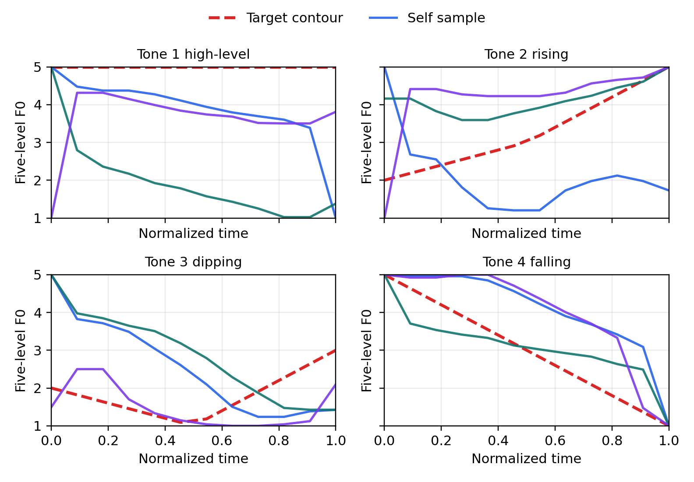
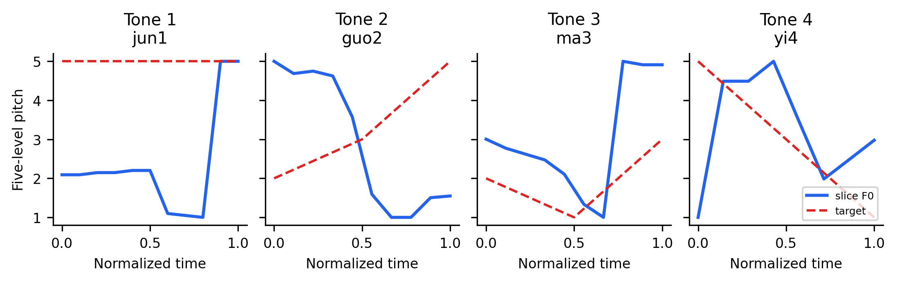

# 面向普通话声调学习的可解释 AI 反馈系统

**作者：叶盛豪**  
**单位：中国科学技术大学，安徽 合肥 230026**  
**项目仓库：<https://github.com/SunTomb/mandarin-tone-feedback>**

## 摘要

普通话声调学习既涉及阴平、阳平、上声、去声等离散调类判断，也涉及基频（F0）轮廓、升降方向和相对调值等连续声学控制。传统自动发音评价若只给出类别或分数，难以解释学习者应当怎样调整音高运动。本文设计并实现一个面向普通话声调学习的可解释 AI 反馈系统：系统接收孤立单字或短词音频，提取并归一化 F0 曲线，将学习者曲线与目标五度调值轮廓进行比较，并生成与声学偏差对应的规则化反馈。

实验部分比较可解释声学特征、冻结 wav2vec2 预训练表征以及二者融合三类声调分类路径。除保留 THCHS 连续语音派生切片作为公开语料基线外，本文构建 1080 条自录普通话孤立单字数据，并在质量过滤后保留 953 条样本。结果显示，在该固定划分下，过滤后融合模型取得最高结果，准确率为 0.3965，宏平均 F1 值为 0.3722，高于单独声学特征和单独 wav2vec2 表征路径；留一说话人声学实验也提示不同说话人之间存在明显差异。系统中的预测声调仅作为参考，核心目标是通过 F0 可视化、目标曲线比较和可解释反馈支持普通话声调学习。

**关键词：** 普通话声调；基频曲线；五度调值；预训练语音表征；可解释反馈

---

## 1. 引言

普通话声调是用音高区别词义的典型超音段特征。对学习者而言，声调困难并不只是“读成了几声”的分类问题，还包括音高起点、升降方向、转折位置和整体稳定性等连续声学控制问题。例如，一声通常要求相对稳定的高平轮廓，二声要求明显上升，三声常表现为低凹或转折，四声则要求快速下降。如果自动系统只给出“正确/错误”或一个总分，学习者难以知道自己应当调整哪个声学维度。

语言科学课程中的声学语音学和音系学概念为这一问题提供了自然框架。声学语音学把语音视为可测量的物理信号，F0 曲线可作为声调分析的重要线索；音系学区分调类和调值，前者是语言系统中的类别，后者是具体音高实现。普通话四声可分别对应阴平、阳平、上声和去声等调类，也可用赵元任五度标记法近似描述为相对音高轮廓。语言习得视角进一步强调，学习者需要从连续声学输入中形成离散声调范畴，同时也需要通过反馈修正自己的产出。

已有声调学习研究表明，二语学习者可以通过有组织的感知训练改善普通话声调辨认能力。Wang 等关于美国学习者普通话声调感知训练的研究说明，高变异输入和反馈能够促进声调类别学习。Gandour 对东亚语言声调感知的综述也提示，声调知觉不仅依赖绝对音高，还与轮廓方向、时长、音域归一化以及母语经验有关。汉语作为第二语言教学研究同样强调声调偏误、听辨训练和产出反馈之间的关系。这些发现说明，声调学习系统不应只关注一个分类标签，而应帮助学习者把连续音高线索映射到稳定调类。

计算机辅助发音训练（computer-assisted pronunciation training, CAPT）则提供了工程和教学上的背景。Witt 和 Young 提出的音位级发音评分展示了自动语音识别技术在发音评价中的潜力；Neri 等指出 CAPT 系统不仅需要识别错误，还需要提供学习者能够理解并据此修正的反馈；Eskenazi 进一步总结了教育场景中语音技术的机会和限制。对本文任务而言，普通话声调反馈比音段发音评分更依赖 F0 轮廓，因此“可解释反馈”比单一正确率更重要。

与此同时，wav2vec2 等预训练语音模型为声调分类提供了新的计算路径。它们通过大规模无标注语音学习表征，可能捕捉到比少量手工声学特征更丰富的音段和超音段信息。HuBERT 等自监督模型也说明，离散预测目标和上下文编码可以学习到强语音表征。然而，面向学习者的系统不能只追求分类准确率，还需要把模型输出转化为可理解、可操作的反馈。

本文考察三个层面的问题：

1. F0 曲线和五度调值比较能否构成学习者可理解的声调反馈界面；
2. 在离线声调分类中，显式声学特征、冻结 wav2vec2 表征及其融合在小规模孤立单字数据上表现如何；
3. 这些实验结果如何限制在线 demo 中“预测仅供参考”的设计边界。

## 2. 语言学背景与相关工作

### 2.1 调类、调值与五度标记

声调语言使用音高差异区别词义。普通话通常分析为四个主要词汇声调：阴平、阳平、上声和去声。这里的“四声”首先是音系系统中的调类，即能够区别词义的类别；具体发音时，不同说话人、语境、语速和音域会导致实际 F0 曲线变化，因此不能把单次曲线简单等同于调类本身。

调值用于描述调类的典型音高实现。赵元任五度标记法把相对音高分为 1 到 5 五个等级，可以把一声近似描述为高平，二声描述为上升，三声描述为低凹或降升，四声描述为下降。普通话语音研究和汉语语音学教材通常也把普通话声调作为音高型超音段特征来处理，强调调类、调值和实际音高实现之间的区分。三声在孤立单字中较容易观察到低凹或降升轮廓，但在连续语音中常出现变体，这也是 THCHS 派生切片更难解释的原因之一。

本文系统的反馈设计建立在“调类—调值”区分上：预测模块提供调类层面的参考判断，F0 可视化和目标曲线比较则帮助学习者理解自己的调值实现。本文中的目标五度曲线只作为教学型相对轮廓，而不是对每个说话人真实 Hz 轨迹的强约束。

### 2.2 F0 轮廓与学习者反馈

F0 是声带振动周期对应的基频，是声调声学分析的重要指标。实验语音学研究通常将基频、时长和强度视为汉语声调声学描写的重要维度。虽然 F0 会受到性别、年龄、个体嗓音范围和语境影响，但归一化后的 F0 轮廓仍可用于比较音高运动方向和相对形状。

本文原型将短音频中的 F0 估计结果映射到 1--5 的相对音高范围。离线实验计算起点、中点、终点、范围、斜率、时长和有声比例等摘要特征；在线 demo 则主要返回归一化曲线、参考预测、目标曲线和反馈项。

反馈规则不使用自由生成文本，而是与可观察声学属性绑定。例如，当目标为二声而终点相对起点上升不足时，系统提示二声需要更明显的上升；当目标为四声而下降幅度不足时，系统提示四声需要更快、更充分的下降。这种设计避免把反馈变成黑箱评价，也符合语言学习中“指出可操作偏差”的需求。

### 2.3 本文与已有工作的关系

与声调感知训练研究相比，本文更关注产出端的即时反馈：系统不是只训练听辨，而是把学习者自己的 F0 曲线与目标调值进行对照。与传统 CAPT 发音评分相比，本文不把输出压缩为总分，而强调曲线、调值和文字反馈之间的一致性。与纯模型比较工作相比，本文把离线分类实验和在线可解释原型拆分开来：离线实验用于分析声学特征和预训练表征的可用性，在线原型则保持轻量、可部署，并明确提示预测调类仅供参考。

## 3. 系统设计与开源实现

系统采用前后端分离结构。前端使用 React 展示目标声调选择、录音或上传入口、反馈卡片和 F0 曲线图；后端使用 FastAPI 接收音频，完成音频读取、F0 提取、轮廓归一化、参考声调预测和反馈生成；离线实验脚本独立于 Web 服务运行，用于训练和评估声调分类模型。

完整数据流为：用户选择目标声调并上传或录制 1--2 s 单字或短词音频；后端读取音频并估计 F0；F0 被归一化到五度范围；系统生成目标声调曲线，并将学习者曲线与目标曲线共同返回给前端；前端以图表和反馈列表展示结果。

第一版原型故意限制在孤立音节或短词层面，不支持完整自动语音识别、句子级评分、账户系统或长期学习记录。这一边界有助于保持项目与语言科学问题对齐：系统关注声调类别、调值轮廓和可解释反馈，而不是通用语音识别或产品化练习平台。在线演示也不依赖实时 GPU 推理，而使用轻量 F0 规则给出参考预测，使网页原型可以在普通开发环境中运行。

后端音频处理包括静音裁剪、16 kHz 重采样、基于 `librosa.pyin` 的 F0 估计、能量与有声概率过滤、轮廓平滑和重采样。为避免把极小的真实音高波动强行拉伸成大幅度五度曲线，系统在归一化前检查 F0 的半音范围；当有效 F0 的变化小于约 2 个半音时，将其视为相对平稳曲线，而不是映射成 1--5 的完整范围。前端反馈卡片也明确标注“预测仅供参考”，并把“置信度”弱化为“参考置信度”，以避免学习者把启发式预测误解为最终评分。

项目代码、实验脚本和网页原型已公开在 GitHub 仓库：<https://github.com/SunTomb/mandarin-tone-feedback>。开源仓库包含后端 API、前端界面、自录数据 manifest 工具、质量过滤脚本、声学基线、预训练表征实验和融合实验脚本。表 1 区分在线 demo 与离线实验的模块边界，避免将网页原型误解为实时运行 wav2vec2 或融合模型。

**表 1 在线 demo 与离线实验的模块关系**

| 模块 | 在线 demo | 离线实验 |
|---|---:|---:|
| F0 提取 | 是 | 是 |
| 规则预测 | 是 | 否 |
| wav2vec2 表征 | 否 | 是 |
| 融合模型 | 否 | 是 |
| 规则反馈 | 是 | 可分析 |

图 1 展示了系统上传分析界面。该界面同时呈现目标声调、参考预测、五度调值、反馈说明以及用户曲线和目标曲线对比。预测声调仅作为参考，学习者应主要依据 F0 曲线形状和具体反馈调整发音。

## 4. 数据构建与实验方法

### 4.1 THCHS 派生切片

本文首先保留 THCHS-30 / OpenSLR SLR18 派生声调切片作为公开语料基线。THCHS-30 原生并不提供人工切分的孤立音节声调标签，因此该流程从转写文本中的拼音数字声调提取 1--4 声标签，排除轻声和非声调 token，并按转写顺序对整句音频进行确定性近似切分。候选切片再经过时长、RMS 能量和有声帧比例过滤。pilot 设置中最终得到 480 个切片，四声均衡，其中训练集 320 个、验证集 80 个、测试集 80 个。

该数据适合作为可复现公开语料基线，但不能被描述为人工标注的孤立音节学习者语料。连续语音中的声调会受到协同发音、句调、边界误差和上下文影响，因此 THCHS 结果在本文中主要用于说明公开语料派生流程的可行性及其局限。

### 4.2 自建孤立单字数据集

为了更贴近声调反馈系统的使用场景，本文进一步构建自录普通话孤立单字数据集。数据目录采用 `data/self/{speaker}-{tone}-{repetition}` 结构，其中目录名编码说话人、目标声调和重复批次。每个声调批次包含 30 个单字录音。原始 manifest 共 1080 条样本，三名说话人各 360 条，四个声调各 270 条；按预设划分得到训练集 480 条、验证集 240 条、测试集 360 条。

考虑到自录数据中可能存在静音过长、响度过低或有效有声帧不足等问题，本文使用宽松质量过滤策略：时长限制为 0.25--3.2 s，有声比例不低于 0.12，有声帧数不低于 8，RMS 不低于 0.005。过滤后保留 953 条样本，其中训练集 401 条、验证集 209 条、测试集 343 条。

主结果采用 speaker03 作为 held-out test speaker，非测试说话人的第 3 次重复作为 val，其余为 train。当前基线实验仅使用 train split 训练，并在 test split 上报告结果；val split 在本版本中保留为未来阈值或超参数选择集合，未参与表格结果的模型选择。此外，为检查说话人差异，本文另行构造三个 leave-one-speaker-out acoustic baseline。过滤后 speaker01、speaker02、speaker03 分别保留 320、290、343 条，tone1--tone4 分别保留 259、249、250、195 条。tone4 保留数量较少，后续结果解释中需要考虑这一不平衡。

**表 2 自录数据质量过滤前后的样本统计**

| 统计项 | 原始数据 | 过滤后 |
|---|---:|---:|
| 总样本数 | 1080 | 953 |
| 训练集 | 480 | 401 |
| 验证集 | 240 | 209 |
| 测试集 | 360 | 343 |
| 说话人1 | 360 | 320 |
| 说话人2 | 360 | 290 |
| 说话人3 | 360 | 343 |
| 一声 | 270 | 259 |
| 二声 | 270 | 249 |
| 三声 | 270 | 250 |
| 四声 | 270 | 195 |

表 2 说明，质量过滤虽然去除了低质量录音，但也引入了新的分布差异，尤其是四声样本下降较多。这一现象对解释实验结果很重要：如果某一调类在过滤后样本较少，分类器的宏平均 F1 值和混淆模式都可能受到影响。因此，本文在讨论 tone4 弱项时，不把它简单归因于模型能力，而同时考虑录音质量、F0 估计和样本分布。

### 4.3 模型设置与可复现性

声学基线使用可解释特征，包括归一化 F0 起点、中点、终点、范围、斜率、时长和有声比例，并训练随机森林分类器。实现中使用 200 棵树并采用 class weight balanced，以减轻过滤后类别不均衡的影响。这一路径直接对应声学语音学中的 F0 轮廓分析，也是 Web 反馈规则的主要依据。

预训练表征模型使用冻结的 `facebook/wav2vec2-base` 编码器。音频被重采样到 16 kHz 后输入模型，取最后隐藏层的 mean pooling 作为 utterance-level representation，再用 logistic regression 区分四个声调。融合模型将声学特征与 wav2vec2 表征按行拼接，再用 logistic regression 进行四分类。融合路线的假设是：预训练表征捕捉更丰富的语音信息，而显式 F0 特征提供与声调直接相关的音高运动线索。分类器实现依赖 scikit-learn，预训练模型缓存放在项目服务器环境中，以保证离线复现时不依赖实时下载。

## 5. 实验结果与分析

表 3 给出 THCHS 派生切片和自录孤立单字数据上的主要实验结果。所有准确率和宏平均 F1 值均来自项目实际训练输出。

**表 3 不同数据与模型路径的声调分类结果**

| 数据/模型 | 准确率 | 宏平均 F1 值 |
|---|---:|---:|
| THCHS raw acoustic | 0.2250 | 0.1983 |
| THCHS raw wav2vec2 | 0.3125 | 0.3149 |
| THCHS raw fusion | 0.2625 | 0.2599 |
| Self raw acoustic | 0.3639 | 0.3198 |
| Self raw wav2vec2 | 0.3389 | 0.3211 |
| Self raw fusion | 0.3556 | 0.3373 |
| Self filtered acoustic | 0.3761 | 0.3275 |
| Self filtered wav2vec2 | 0.3644 | 0.3354 |
| **Self filtered fusion** | **0.3965** | **0.3722** |

在 THCHS pilot 设置下，wav2vec2 冻结表征优于声学基线和简单融合，说明预训练语音表征可能捕捉到一部分与声调分类相关的信息；但整体准确率较低，反映出连续语音近似切片对声调分类的限制。自录孤立单字数据更接近本文系统的使用场景，在三类模型路径上均得到高于 THCHS 基线的结果；但二者切分方式、录音场景和标签来源不同，因此这种比较主要反映任务条件差异，而不是语料之间的公平优劣比较。

在当前固定划分和 lenient 过滤策略下，过滤后最佳融合模型的 macro-F1 从 0.3373 提升到 0.3722，提示低质量录音可能影响声调分类；但由于过滤也改变了调类和说话人分布，这一结果不能单独解释为模型能力提升。同时，结果也显示模型性能并不高，不能把系统包装成可靠的自动判分器。尤其是在学习者反馈场景中，预测调类只能作为辅助提示。本文因此在原型中强调 F0 曲线、目标曲线比较和规则化声学反馈，而不是把分类准确率作为唯一目标。

为观察说话人差异，本文在过滤后的自录数据上进行留一说话人声学基线实验，结果见表 4。

**表 4 过滤后自录数据的留一说话人声学基线结果**

| 测试说话人 | 准确率 | 宏平均 F1 值 |
|---|---:|---:|
| speaker01 | 0.5156 | 0.5028 |
| speaker02 | 0.3276 | 0.3186 |
| speaker03 | 0.3761 | 0.3275 |

不同测试说话人的结果差异明显：speaker01 上的宏平均 F1 值为 0.5028，而 speaker02 和 speaker03 分别为 0.3186 和 0.3275。这说明即使在孤立单字和相对受控的录音条件下，声调分类仍受到说话人音域、录音质量、发音习惯和样本分布影响。对声调学习系统而言，这一结果支持两个设计选择：第一，前端不应把预测声调展示为绝对正确的评价；第二，反馈应尽量使用相对 F0 曲线和目标轮廓比较，而不是依赖跨说话人的绝对音高。

图 2 展示了自录测试说话人样本中的四声 F0 轮廓，并叠加目标五度曲线。该图来自真实自录音频，直接对应本文主数据路径，也说明学习者反馈界面为什么应展示曲线形状而不是只给出预测类别。

图 3 展示 THCHS 派生切片中的 F0 示例。由于这些切片来自连续语音，图中的轮廓既包含声调相关的音高运动，也可能受到上下文、句调和切分边界影响。因此，THCHS 图更适合作为“公开语料切片存在局限”的分析材料，而不是最终学习者反馈的理想数据来源。

根据实验记录中的分类摘要，tone4 是需要重点检查的类别，部分错误可能与 tone3 相关；由于本文未展开逐类误差统计，后续应以混淆矩阵和人工复核进一步确认这一模式。一个可能原因是四声下降段若录得过短、末端能量偏弱或被静音裁剪影响，F0 估计可能无法完整捕捉高起低落；另一方面，三声在实际发音中也可能出现低降或不完整降升，使其与下降类轮廓产生混淆。这个现象提醒我们，声调反馈不能只判断类别，还应解释“下降是否充分”“低凹是否明显”“终点是否回升”等可观察维度。

## 6. 局限与扩展方向

本文仍有若干局限。首先，自录数据规模较小，说话人数量有限，且质量过滤改变了调类和说话人分布；其次，THCHS 数据只是连续语音派生切片，不能替代人工对齐的孤立音节声调语料；再次，当前没有在正文中展开完整逐类混淆矩阵，因此 tone4 的误差模式仍需进一步验证。

围绕这些局限，后续实验可以划分为三类：

1. **数据侧扩展。** 继续增加说话人数量、扩大每个调类的单字覆盖，并把当前 lenient 质量过滤扩展为多阈值 sweep。具体可比较最小有声比例、最小 RMS、最小时长和最大时长对样本保留率、四声分布和分类性能的影响。这类实验可以回答“过滤是否只是丢弃困难样本，还是确实去除了无效录音”。
2. **模型侧扩展。** 对 wav2vec2、HuBERT 和 Whisper encoder 表征进行同一划分下的横向比较，并把留一说话人实验从声学基线扩展到表征模型和融合模型。若计算资源允许，还可以进行轻量 adapter 或最后若干层微调，但网页原型仍不依赖实时 GPU 推理。这样可以把“离线研究模型”和“在线可解释 demo”清楚分开，避免把服务器训练能力误认为系统部署条件。
3. **反馈侧扩展。** 做规则消融和小规模人工评价。规则消融可以分别移除斜率、范围、三声低凹、四声下降等反馈规则，观察自动反馈和人工判断的一致性。人工评价可以让普通话母语者或学习者对若干录音的声调类别、曲线偏差和反馈可理解性进行评分，再与系统输出比较。

这些扩展实验在本文当前版本中作为可复现计划提出，尚未写入未运行的准确率或显著性检验结果。

## 7. 课程关联与系统意义

本文原型的学习者反馈并不直接复述模型分类结果，而是把预测与 F0 曲线结合。例如，对于目标二声，若学习者曲线从起点到终点的上升幅度不足，系统生成与“上升不充分”相关的提示；对于目标四声，若起点到终点下降不足，则生成与“下降不充分”相关的提示。反馈列表中的每一项都对应可解释声学属性，学习者可以在图上看到自己的曲线如何偏离目标曲线。

从课程内容看，该系统连接了多个语言科学概念：

1. 使用声学语音学方法测量 F0、时长和有声帧比例，把语音作为可计算信号处理；
2. 使用音系学中的调类概念组织四声分类，同时用五度调值解释具体音高形状；
3. 回应语言习得中的范畴学习问题：学习者需要从连续声学输入中形成离散声调类别，并通过反馈调整产出；
4. 把 wav2vec2 等预训练语音模型作为计算语言科学工具，用真实语音表征实验支持系统设计；
5. 通过留一说话人结果体现表征归一化和个体差异问题：模型和学习者都需要在不同说话人的绝对音高差异中抽取稳定的声调信息。

## 8. 结论

本文设计并实现了一个面向普通话声调学习的可解释 AI 反馈系统。实验上，自建孤立单字数据比 THCHS 连续语音切片更贴近声调反馈任务；在当前过滤策略下，最佳融合模型的宏平均 F1 值高于未过滤设置；留一说话人结果揭示了说话人差异对声调分类的影响。

系统上，Web 原型把 F0 提取、五度调值目标轮廓、参考预测和可解释反馈整合到一个可运行界面中。更重要的是，本文没有把“预测几声”作为唯一贡献，而是把预测结果限制为参考，把核心放在 F0 曲线可视化、目标轮廓比较和面向学习者的可操作反馈上。未来工作可扩展更多说话人与真实学习者数据，引入人工评分作为外部效标，并探索更稳健的预训练表征微调与融合方法。

## 参考文献

1. CHAO Y R. A system of tone letters[J]. *Le Maître Phonétique*, 1930, 45: 24-27.
2. 朱晓农. 语音学[M]. 北京: 商务印书馆, 2010.
3. 黄伯荣, 廖序东. 现代汉语: 增订六版[M]. 北京: 高等教育出版社, 2017.
4. 刘珣. 对外汉语教育学引论[M]. 北京: 北京语言文化大学出版社, 2000.
5. WANG Y, SPENCE M M, JONGMAN A, et al. Training American listeners to perceive Mandarin tones[J]. *Journal of the Acoustical Society of America*, 1999, 106(6): 3649-3658.
6. GANDOUR J. Tone perception in Far Eastern languages[J]. *Journal of Phonetics*, 1983, 11(2): 149-175.
7. 赵金铭. 对外汉语教学概论[M]. 北京: 商务印书馆, 2004.
8. WITT S M, YOUNG S J. Phone-level pronunciation scoring and assessment for interactive language learning[J]. *Speech Communication*, 2000, 30(2/3): 95-108.
9. NERI A, CUCCHIARINI C, STRIK H, et al. The pedagogy-technology interface in computer assisted pronunciation training[J]. *Computer Assisted Language Learning*, 2002, 15(5): 441-467.
10. ESKENAZI M. An overview of spoken language technology for education[J]. *Speech Communication*, 2009, 51(10): 832-844.
11. BAEVSKI A, ZHOU Y, MOHAMED A, et al. wav2vec 2.0: A framework for self-supervised learning of speech representations[C]// *Advances in Neural Information Processing Systems*. 2020, 33: 12449-12460.
12. HSU W N, BOLTE B, TSAI Y H H, et al. HuBERT: Self-supervised speech representation learning by masked prediction of hidden units[J]. *IEEE/ACM Transactions on Audio, Speech, and Language Processing*, 2021, 29: 3451-3460.
13. 林焘, 王理嘉. 语音学教程[M]. 北京: 北京大学出版社, 2013.
14. 吴宗济, 林茂灿. 实验语音学概要[M]. 北京: 高等教育出版社, 1992.
15. 石林. 实验音系学概要[M]. 北京: 北京大学出版社, 1986.
16. DONG W, HUANG S, XU B. THCHS-30: A free Chinese speech corpus[R/OL]. OpenSLR SLR18, 2015.
17. MCFEE B, RAFFEL C, LIANG D, et al. librosa: Audio and music signal analysis in Python[C]// *Proceedings of the 14th Python in Science Conference*. 2015: 18-25.
18. PEDREGOSA F, VAROQUAUX G, GRAMFORT A, et al. Scikit-learn: Machine learning in Python[J]. *Journal of Machine Learning Research*, 2011, 12: 2825-2830.
19. 叶盛豪. 面向普通话声调学习的可解释 AI 反馈系统项目[EB/OL]. <https://github.com/SunTomb/mandarin-tone-feedback>.
